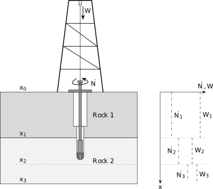

# Background
:copyright: 2021, Johannes Wiebe. Refer to [License](LICENSE).

This repository contains an implementation of the drill scheduling problem
outlined in Section 3.2 of [A robust approach to warped Gaussian process-constrained optimization](https://arxiv.org/abs/2006.08222).

If you use this work, please cite our paper:

    @misc{Wiebe2020robust,
          title={A robust approach to warped Gaussian process-constrained optimization}, 
          author={Johannes Wiebe and Inês Cecílio and Jonathan Dunlop and Ruth Misener},
          year={2020},
          eprint={2006.08222},
          archivePrefix={arXiv},
          primaryClass={math.OC}
    }

The drill scheduling problem is an optimization problem which attempts to
minimize the total completion time of drilling a well. It considers:

1. The time spent drilling
2. The time spent doing maintenance on the Positive Displacement Motor (PDM)

The solution of the problem is a schedule of drill parameters weight on bit W
and rotational speed N, as illustrated below:

The relationship between the PDM's rate of degradation and differential
pressure across the PDM, which depends on the drill parameters, is only known
in form of expensive simulations and experiments. Our approach to this problem
trains a [Gaussian Process](https://en.wikipedia.org/wiki/Gaussian_process)
based on a small data set for this relationship.

For a detailed description of the problem and the optimization model, please
look at Section 3.2 of [our paper](https://arxiv.org/abs/2006.08222).

# Requirements

The optimization model is implemented in [Pyomo](http://www.pyomo.org/). In
order to use Gaussian Processes with Pyomo we use [ROGP](https://github.com/johwiebe/rogp).
To install ROGP, run:

    python -m pip install git+https://github.com/johwiebe/rogp.git

This will also install Pyomo. Using Pyomo to solve optimization problems also
requires a suitable solver to be installed. We use
[Ipopt](https://github.com/coin-or/Ipopt).

# Usage

Run `example.py` for a full example in action.

## Setting up the drill-string

In this simplified model, the drill string consists of the bit and PDM.
Setting up the bit just requires two parameters, the bit radius and the ratio
of inner to outer bit radius:

    # Bit
    bit = tools.Bit(100, 0)

The model of the PDM consists of three components: a function modeling motor
RPM vs differential pressure, a function modeling torque vs differential
pressure, and a function modeling rate of degradation vs differential
pressures. Details of the model can be found in Section 3.2 and Appendix D of
[our paper](https://arxiv.org/abs/2006.08222).

We model the RPM and torque curves as quadratics:

    # Motor curves
    rpmcurve = curves.Quadratic(np.array([[0., 100.],
                                          [1400., 60.],
                                          [2500., 0.]]))
    torquecurve = curves.Quadratic(np.array([[0., 0.],
                                             [1400., 3.5],
                                             [2500., 5.0]])),

and the degradation curve using a (warped) Gaussian Process:

    # Motor degradation curve
    data = np.load('gp_data.npy')
    x, y = data[:,0,None], data[:,1,None]
    failurecurve = curves.WarpedGP(x, y, warping_terms=2)

The final steps then are to define the PDM, drill string and a cost function
for maintenance:

    # PDM
    pdm = tools.PDM(rpmcurve, torquecurve, failurecurve, initial_degradation, 1/1500/25)

    # Drill string
    drillstring = tools.DrillString(pdm, bit)

    # Cost function maintenance
    cost_maint = curves.Linear(np.array([[0., 4.],
                                         [4000., 20.]]))

## Setting up the geology
    
We use a simple geology consisting of two types of rocks which alternate. Rock
types are defined using a set of six parameters:

    rock1 = geology.Rock(278, 330, 125, 0.48, 157, 0.98)
    rock2 = geology.Rock(315, 68.6, 50, 0.93, 33, 0.65)

The geology is defined by the depths at which a new rock type begins:

    geo = geology.Geology({0: rock2,
                           100: rock1,
                           200: rock2,
                           400: rock1,
                           550: rock2,
                           800: rock1,
                           1800: rock2,
                           2000: rock1,
                           2500: rock2,
                           2600: rock1})

## Building and solving the model:
    
A deterministic model is defined using the `Deterministic` class:

    scheduler = sc.Deterministic(geo, drillstring, cost_maint, xfin=3500)

A model using the Wolfe Duality based reformulation described in our paper can
be defined using the `Wolfe` class:

    scheduler = sc.Wolfe(geo, drillstring, cost_maint, xfin=3500, alpha=0.95)

To solve the model need to either choose the enumeration algorithm, or one of
the heuristics described in Section 3.2.2 of our paper:

    # Enumeration
    algo = algorithms.enum

    # Boundary heuristic
    algo = algorithms.boundary_heuristic

    # No-degradation heuristic
    algo = algorithms.no_degradation_start_heuristic

Finally, build and solve the model using:

    scheduler.build()
    scheduler, obj = algo(scheduler)

# Acknowledgements
This work was funded by the Engineering & Physical Sciences Research Council
(EPSRC) Center for Doctoral Training in High Performance Embedded and
Distributed Systems (EP/L016796/1) and an EPSRC/Schlumberger CASE studentship
(EP/R511961/1, voucher 17000145).

Author: Johannes Wiebe
